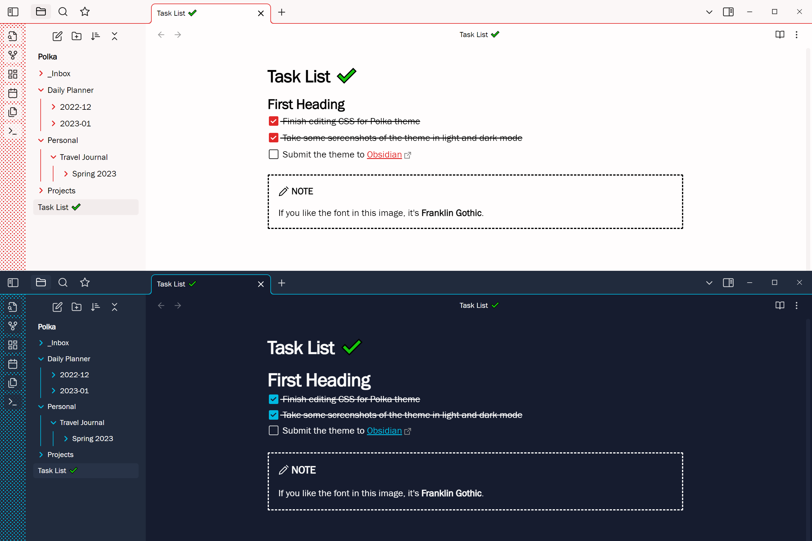

# Polka

This theme adds some colorful minimalism to Obsidian in light and dark modes, with dots in the ribbon.

It comes with slight modifications of the default color settings for the Kanban plugin, so that it suits the palette better.

