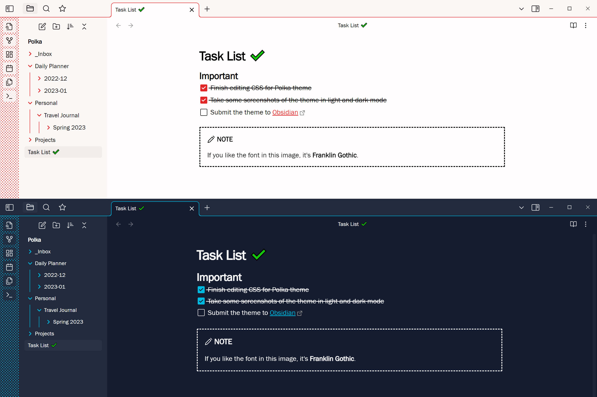

# Polka

This theme adds some colorful minimalism to Obsidian in light and dark modes, with characteristic dots in the ribbon.



## Color Customization

Due to the way the theme shares color values between elements for cohesion, Polka ignores the accent color in your Obsidian settings. You can choose your own accent color for the ribbon (and other elements which share the color) but you'll need to [create your own CSS snippet](https://help.obsidian.md/Extending+Obsidian/CSS+snippets) and override the `--accent-main` parameter with a raw RGB value. For example, in dark mode:

```
.theme-dark {
  --accent-main: 0, 255, 70 !important;
}
```

Replace `.theme-dark` with `.theme-light` for light mode.

## Fonts

The user is left to select which font families are loaded, although Polka is set up to use your default monospace font in table content for better number formatting.

The font used in the preview image is Franklin Gothic, which is available as standard on Windows. If you want a good, free alternative, try [Rubik](https://fonts.google.com/specimen/Rubik).

## Plugin Support

In addition to modifying your workspace, Polka's colors are adapted for Obsidian's UI and the whole suite of core plugins. Additional attention has been given to:

- Syntax highlighting in code blocks (Polka uses the built-in color scheme but refines the hues).
- [Execute Code](https://github.com/twibiral/obsidian-execute-code).
- [Kanban](https://github.com/mgmeyers/obsidian-kanban).
