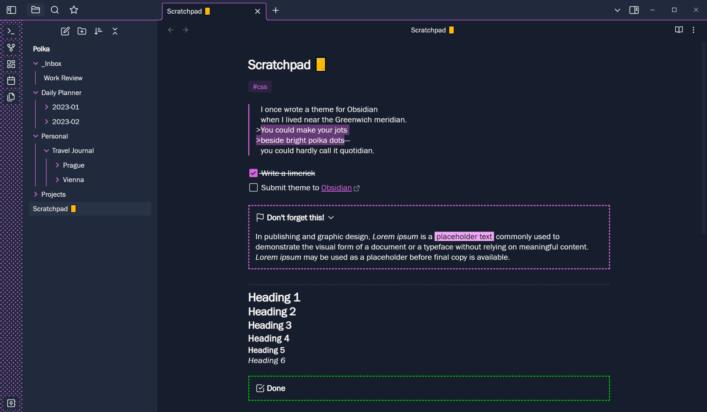

# Polka

This theme adds some colorful minimalism to Obsidian in light and dark modes, with characteristic dots in the ribbon. Major features include a fully customizable color scheme and independent selection of themes for code blocks.

## Color Customization

Polka responds to the accent color in your main settings (under `Appearance > Accent color`) by using it for links, highlights, the dots in the ribbon and much else besides. For example, if you choose a pink accent color while in dark mode, the default cyan will be replaced in all the ways you can see below (and more):

If you install the [Style Settings](https://github.com/mgmeyers/obsidian-style-settings) plugin, you will also get access to a menu that allows you to customize the background color palette, with independent settings for light and dark modes.

Once installed, under `Style Settings > Polka Theme`, you can use sliders to adjust the hue, saturation, lightness and contrast of the background colors. You never have to worry about setting things up just right to avoid clashes, as your base color is used to generate a palette that applies to the whole user interface. Here are some examples that took less than ten seconds to dial in:

## Code Block Customization

When you install Style Settings, the menu also gives you a list of dedicated sub-themes that apply exclusively to code blocks. Polka has nicely contrastive default colors but you can also use well-known schemes like Dracula, Gruvbox, Nord, One Dark and Solarized. [Let me know](https://github.com/callumhackett/obsidian_polka_theme/issues) if there's another palette you'd like me to include.

## Additional Customization Options

As well as the above, the style settings plugin gives you access to the following parameters:

- Main text color
- Text highlight color
- Roundness of page elements
- Circular vs. square checkboxes
- Monospace font in tables

## Fonts

Font taste is personal. Polka selects nice default fonts for Mac and PC but your main font settings (under `Appearance > Font`) will override these.

The font in the preview images here is Franklin Gothic, which is distributed with Windows. If you want a good, free alternative, try [Rubik](https://fonts.google.com/specimen/Rubik).

## Plugin Support

As well as modifying your workspace, Polka adapts the colors of Obsidian's user interface and the whole suite of core plugins. Additional attention has been given to the following community plugins:

- [Calendar](https://github.com/liamcain/obsidian-calendar-plugin)
- [Dictionary](https://github.com/phibr0/obsidian-dictionary)
- [Execute Code](https://github.com/twibiral/obsidian-execute-code)
- [File Tree Alternative](https://github.com/ozntel/file-tree-alternative)
- [Kanban](https://github.com/mgmeyers/obsidian-kanban)

Many others will fit in without issue but [let me know](https://github.com/callumhackett/obsidian_polka_theme/issues) if you think I should support something else.
