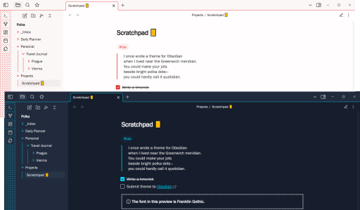

# Polka

This theme adds some colorful minimalism to Obsidian in light and dark modes, with characteristic dots in the ribbon.



## Color Customization

Due to the way the theme shares color values between elements for cohesion, Polka ignores the accent color in your Obsidian settings. You *can* choose your own accent color to be used throughout the theme but you'll need to [create a CSS snippet](https://help.obsidian.md/Extending+Obsidian/CSS+snippets) and override the `--accent-main` parameter with a raw RGB value. For example:

```
.theme-dark {
  --accent-main: 210, 65, 255 !important;
}
```

You can see the effect of the code above in the preview below, which also displays the theme's callout formatting:


If customizing light mode, use `.theme-light` instead of `.theme-dark`.

## Fonts

The user is left to select which fonts are loaded, although Polka is set up to use your default monospace font in table content, just in case your body font doesn't have tabular numbers (you can override this with a CSS snippet by targeting the `--table-body-font` parameter).

The font displayed in the preview images is Franklin Gothic, which is available as standard on Windows. If you want a good, free alternative, try [Rubik](https://fonts.google.com/specimen/Rubik).

## Plugin Support

In addition to modifying your workspace, Polka has color adaptations that apply to Obsidian's UI and the whole suite of core plugins.

Syntax highlighting in code blocks follows the built-in color scheme but the hues have been refined.


Additional attention has also been given to these community plugins:

- [Calendar](https://github.com/liamcain/obsidian-calendar-plugin).
- [Dictionary](https://github.com/phibr0/obsidian-dictionary).
- [Execute Code](https://github.com/twibiral/obsidian-execute-code).
- [Kanban](https://github.com/mgmeyers/obsidian-kanban).
